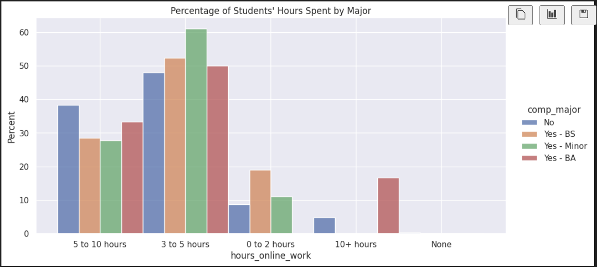
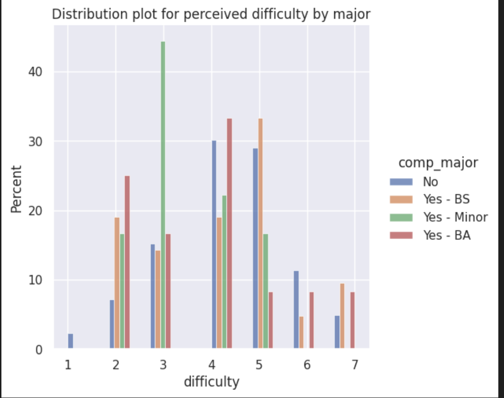
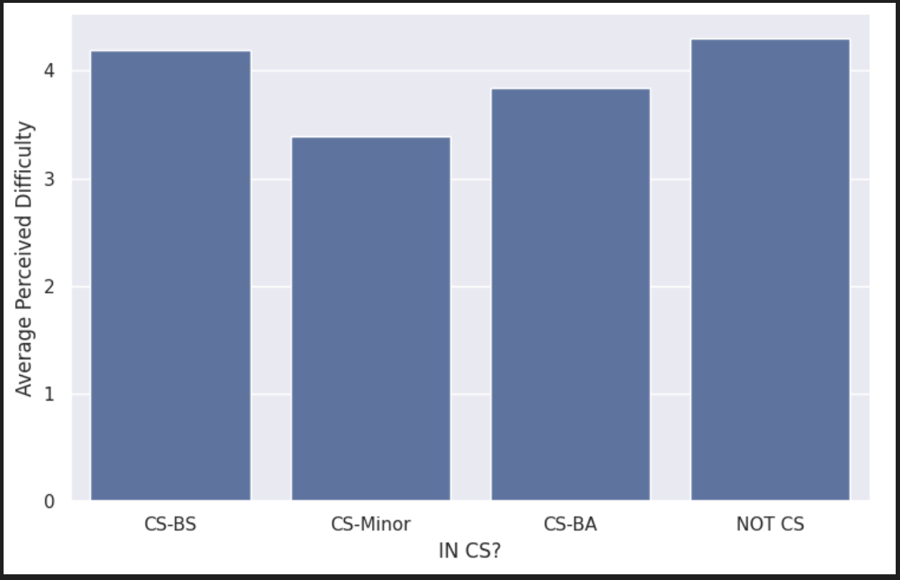

---
# Do not edit the text between these lines!
layout: default
---

# EX09 Website

<!-- This is a comment. Below, you'll see code for inserting an image. To make this image appear, update <custom-path>. To add an image, save it inside the imgs folder of this repository. -->

## Summary

I analyzed the survey data to decipher whether or not COMP110 should be split into separate section for majors and non-majors. This analysis was conducted based on the following: the distribution of hours spent working outside of class and the students' perceived difficulty of the course. I used Jupyter Notebooks, and the library seaborn, as well as other self-created functions to normalize the data and visualize it based on Major Status (BS, BA, Minor, or Non-CS)

## Visualization 1

This graph shows the percentage of students in each major category and how many hours they spent working online. Non-CS students skew toward the 5-10 and 10+ hour marks.

## Visualization 2

This distribution plot shows the students' perceived difficulty. Non-CS majors have a light spike at the higher difficulty ratings compared to the CS tracks.

## Visualization 3

Using a custom helper function, I calculated the average difficulty rating for every CS track and for non-CS majors. This shows that Non-CS and CS-BS students face the most difficulties, while BAs and Minors find the course noticeably easier.

This is basic paragraph text.